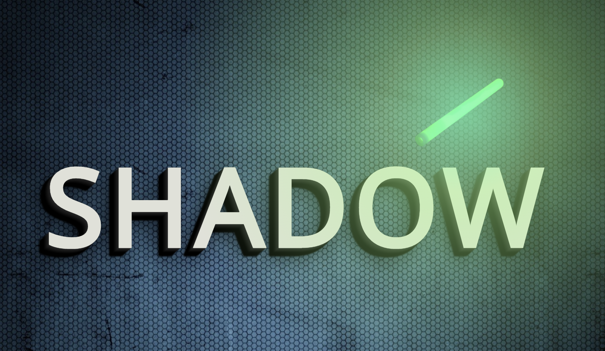

# JS Dynamic shadow

[LIVE DEMO](https://marclopezavila.github.io/js-dynamic-shadow/)

[CODEPEN](https://codepen.io/Loopez10/pen/QNJdeX)

Text shadow depending on the light focus. I made it with CSS and JS using multiple text shadow property, creating a 3D effect.

*Old code from my first projects moved to GitHub*